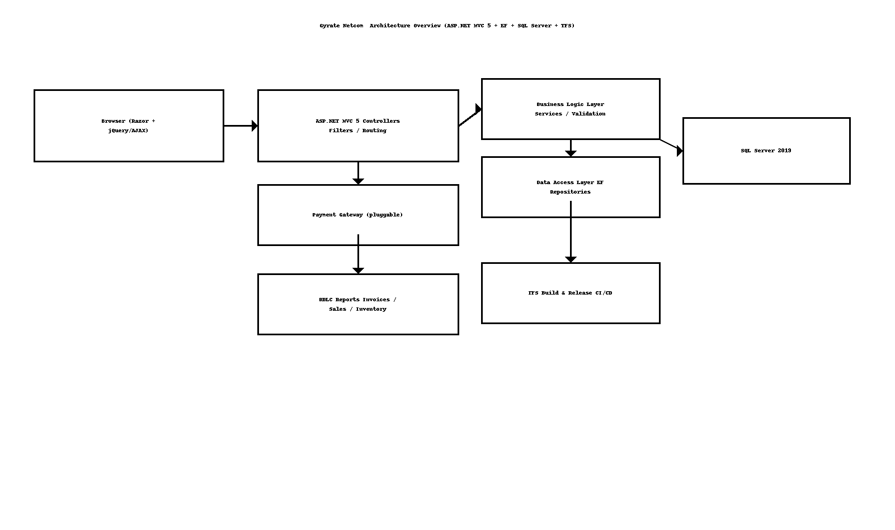

# Gyrate Netcom – High‑Level Design (HLD)

> **Author:** Sagarika Chakraborty — Full Stack .NET Engineer | React.js | Web API | SQL Server

## 1. Overview & Scope
Gyrate Netcom is an e‑commerce web app for **online grocery shopping**. It provides:
- **Product catalogue & search**, category navigation, product details.
- **Shopping cart & checkout**, order creation, payment gateway integration (pluggable).
- **Order tracking** (Placed → Packed → Shipped → Delivered).
- **Admin portal** for products, categories, inventory, pricing, promotions, and orders.
- **Role‑based access** (Admin, Vendor, Customer) and **responsive UI**.

## 2. Goals & NFRs
- **Security**: Forms auth / ASP.NET Identity (as applicable), HTTPS, CSRF protection, input validation.
- **Performance**: Optimized EF/LINQ queries; output caching where safe; paging for listings.
- **Scalability**: Stateless controllers; DB indexes; optional caching (in‑proc/Redis).
- **Reliability**: Transactional checkout; idempotent order submission; retry on payment confirmation callbacks.
- **Maintainability**: 3‑layer architecture (BLL/DAL/Models) with repository pattern; clear separation of concerns.
- **Observability**: Structured logs, audit trails for admin actions; error monitoring.

## 3. Architecture


```mermaid
flowchart LR
  A[Browser (Razor + jQuery/AJAX)] --> B[ASP.NET MVC 5 Controllers]
  B --> C[BLL (Services, Validation)]
  C --> D[DAL (EF Repositories)]
  D --> E[(SQL Server)]
  B --> F[RDLC Reports]
  B --> G[Payment Gateway (pluggable)]
  B --> H[TFS Build & Release]
```

## 4. Core Modules
- **Catalogue**: Categories, products, search, filters, pricing.
- **Cart & Checkout**: Cart, address/payment selection, order placement, summary, confirmation.
- **Orders**: Order tracking, history, invoices; admin order processing (pack/ship/mark delivered).
- **Admin**: CRUD for products/categories, inventory & price updates, promotions.
- **Users**: Registration/login, profiles, addresses, feedback.
- **Reporting**: RDLC invoices and sales/inventory reports.

## 5. Data Flow (Happy Paths)
1. Customer browses catalogue, adds items to **Cart**.
2. **Checkout** captures address + payment; server validates & creates **Order** transactionally.
3. Payment confirms (sync/async); order status set to **Placed**; notifications sent.
4. Admin processes order (Packed → Shipped → Delivered); customer tracks in **My Orders**.
5. Admin manages inventory and pricing via portal; reports available via RDLC.

## 6. Security
- Anti‑forgery tokens, input validation, server‑side checks.
- Role‑based authorization attributes on controllers/actions.
- Sensitive fields protected; TLS enforced; parameterized SQL.

## 7. Availability & DR
- Regular DB backups; scripted restores; roll-forward testing.
- Blue/green or staged deployments through TFS (as applicable).

## 8. CI/CD
- **TFS** for version control & release; automated build → test → deploy pipeline.
- Configuration per environment (Dev/QA/Prod).

## 9. Assumptions
- Payment provider exposes REST APIs and webhook callbacks.
- Emails/SMS handled by pluggable providers.
