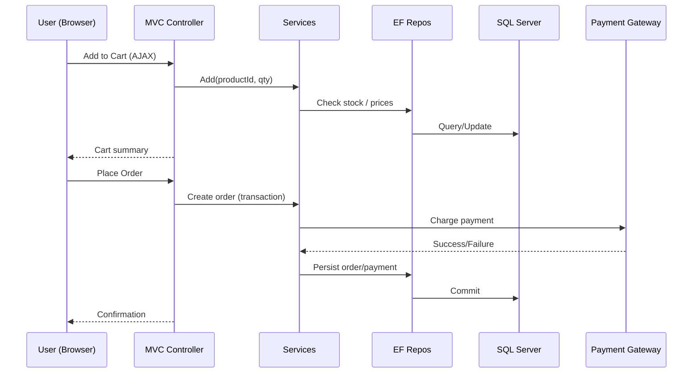

# Gyrate Netcom – Low‑Level Design (LLD)

> **Author:** Sagarika Chakraborty — Full Stack .NET Engineer | React.js | Web API | SQL Server

## 1. Solution Layout (3‑Layer)
- **Gyrate.Web** — ASP.NET MVC 5 (Controllers, Views/Razor, Filters, Bundles)
- **Gyrate.BLL** — Services (Catalogue, Cart, Orders, Users), Validators, Mappers
- **Gyrate.DAL** — EF DbContext, Repositories, Migrations/SQL Scripts
- **Gyrate.Models** — Entities, DTOs/ViewModels
- **Reports/** — RDLC templates (Invoice.rdlc, Sales.rdlc, Inventory.rdlc)
- **Tests/** — Unit tests for BLL & DAL

## 2. Key Controllers & Actions (samples)
### CatalogueController
- `Index(categoryId, page, size)` — list products by category
- `Search(q, page, size)` — full‑text/like search with filters
- `Detail(id)` — product detail

### CartController
- `Add(productId, qty)` (AJAX) — returns updated cart summary
- `Update(productId, qty)` (AJAX)
- `Remove(productId)` (AJAX)
- `Summary()` — mini‑cart

### CheckoutController
- `Address()` — manage/select addresses
- `Payment()` — payment method; creates order draft
- `PlaceOrder()` — finalize order (transaction) → returns confirmation

### OrderController
- `MyOrders(page, size)` — order history
- `Track(orderId)` — status timeline (Placed → Packed → Shipped → Delivered)
- `Invoice(orderId)` — RDLC invoice render

### Admin Controllers
- `ProductsController` — CRUD, inventory, pricing
- `CategoriesController` — CRUD
- `OrdersController` — process statuses, refunds
- `UsersController` — manage roles (Admin/Vendor/Customer)

## 3. DTOs / ViewModels (examples)
```json
// AddToCartRequest
{ "productId": 123, "quantity": 2 }

// OrderViewModel (excerpt)
{
  "orderId": 100045,
  "items": [{ "productId": 123, "name": "Rice 5kg", "qty": 2, "price": 450.00 }],
  "amounts": { "subtotal": 900.00, "tax": 45.00, "shipping": 0, "total": 945.00 },
  "status": "Placed"
}
```

## 4. Validation & Business Rules
- Stock check at add‑to‑cart and during checkout commit.
- Price lock at order time; tax & discount rules applied in BLL.
- Prevent duplicate order submission (idempotency token).
- CSRF tokens on form posts; server‑side validation for all inputs.

## 5. Persistence (ER Overview)
**Tables**
- `Users(id, email, hash, role, createdAt)`
- `Categories(id, name, parentId)`
- `Products(id, categoryId, name, sku, description, price, stock, imageUrl, isActive)`
- `Orders(id, userId, status, subtotal, tax, shipping, total, createdAt)`
- `OrderItems(id, orderId, productId, qty, price)`
- `Addresses(id, userId, line1, line2, city, state, zip, country)`
- `Payments(id, orderId, provider, txnId, status, amount, at)`
Indexes: `Products(categoryId)`, `Orders(userId, status)`, `OrderItems(orderId)`.

## 6. Sequences


## 7. Error Handling
- `400` validation errors; field map for AJAX responses
- `401/403` auth/authorization
- `404` not found
- `409` stock conflict
- `5xx` unexpected error (friendly message + log correlation id)

## 8. Performance
- EF includes to reduce N+1; compiled queries for hot paths.
- Database indexes; pagination; caching of category tree and product lists.
- Bundling/minification for static assets.

## 9. CI/CD (TFS)
- TFS build: restore → build → test → package.
- Release: config transform per environment; DB migration step; smoke tests.
- Rollback: redeploy previous package; restore DB backup if needed.

## 10. Reports
- **RDLC**: Invoice, Daily Sales, Inventory snapshot; accessible from Admin.
